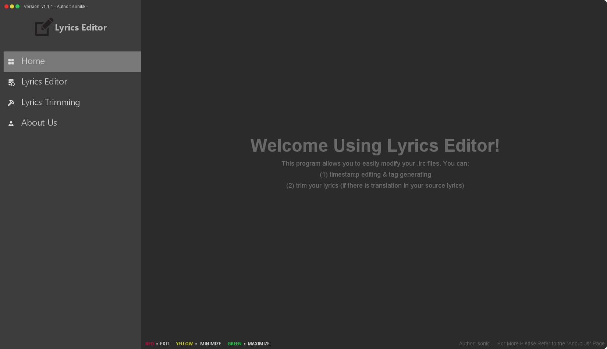

# Lyrics Editor for .LRC
### ■ About this program
This is an open-sourced project that allows the user to easily modify and manage their .LRC (lyrics) files~!
  - Users need to download runtime on their computer before using the .JAR application. (At least for the current version)
  - Current version: v1.1.1

### ■ Current features
1. Lyrics Editor
   - (a.) Lyrics Merging: Allow users to combine the original timestamp with a new lyrics line without much of a stretch.
   - (b.) Timestamp Editing: Allow user to easily edit every line of the timestamp
     - Only 6 digits and 2 decimals are allowed
   - Auto-generating Header Tags: Generate header tags for easy `.LRC` file management (`title tag (ti)`, `artist (ar)`, `album (al)`, length)
2. Lyrics Trimming
   - Allow users to trim their lyrics if the lyrics they copied have both the original language and translated lyrics.

_*For more and .exe installation, please refer to the latest release note.*_

### ■ License & copyright
Copyright (c) FlashSonic526.

Licensed under the [MIT License](LICENSE).